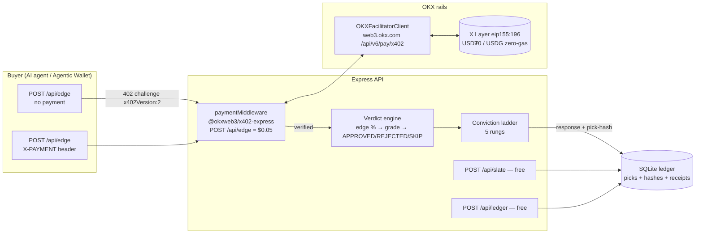

<div align="center">
  
  <h1>EdgeLedger 🚫</h1>
  <p><em>The agent that rejects your bet — pay 5¢, get a verdict, not a prediction.</em></p>
  

  <br/>

  [](https://api.edgeledger.edycu.dev/health)
  [](https://edgeledger.edycu.dev)
  [](https://edgeledger.edycu.dev/pitch)
  [](https://youtube.com/placeholder)
  [](https://www.hackquest.io/hackathons/OKXAI-Genesis-Hackathon)

  <br/>

  
  
  
  
  
  
  
  [](https://github.com/edycutjong/edgeledger/actions/workflows/ci.yml)

</div>

---

## 💡 The Problem & Solution

The `okx.ai` World Cup🔥 category is proven-selling but uniformly **predict-only** — every listed agent tells you *who wins*. None of them will tell a user their proposed bet is bad, size a stake responsibly, or expose an auditable settled record of their own calls. Recreational bettors during a live World Cup mostly lose to **sizing and discipline failures**, not to a shortage of predictions.

**EdgeLedger** is an A2MCP ASP that answers a different question: *"should I bet"*, not *"who wins"*. POST a proposed bet and $0.05 over OKX x402 on X Layer; get back `APPROVED`, `REJECTED`, or `SKIP` — with a named edge grade (A+…F), a conviction-ladder stake, and the settled historical ROI of similar calls. Two companion endpoints are free and public: today's BET/SKIP slate, and the full settled ledger — **losses included**.

**Key Features:**
- 🚫 **Verdict engine** — `APPROVED` / `REJECTED` / `SKIP` on edge-grade bands calibrated to a real settled record, not textbook Kelly. "No bet" is a first-class answer.
- 🪜 **Conviction ladder** — 5-rung stake sizing mapped to edge grade × bankroll.
- 🪞 **Mirror receipts** — every response cites what the seller *actually staked* on the same/most-similar fixture, with settled P&L.
- ⏳ **Signal decay** — `decay_min_halflife` states honestly how fast the edge goes stale toward kickoff.
- 🔓 **BuyerLens (no-login personalization)** — decodes the x402 `X-PAYMENT` header's EIP-3009 `authorization.from` (an unforgeable, ECDSA-recovered identity) into a per-buyer discipline memory — the payment signature *is* the login. `POST /api/me {address}` reads it back; `{forget:true}` deletes it.
- 🧾 **Independent receipt re-verification** — `POST /api/receipts/verify` re-checks any settlement **live against OKX's own Facilitator API**, so a buyer verifies without trusting EdgeLedger's database.
- 📖 **Public, loss-inclusive ledger** — `POST /api/ledger` returns every settled call (pre-match odds, fair prob, edge grade, stake, result, P&L, CLV, pick-hash + receipt) — a moat a predict-only competitor can't fabricate after the fact.
- 🔒 **Pick-commit hashing** — every response's payload hash is stored beside its settlement reference for tamper-evidence.

## 🏗️ Architecture & Tech Stack

| Layer | Technology |
|---|---|
| **Runtime** | Node 20 + Express (long-lived server — the 402→pay→settle handshake wants no cold starts) |
| **Language** | TypeScript (strict), run directly via `tsx` — no bundler/build step |
| **Payments** | `@okxweb3/x402-express` + `@okxweb3/x402-core` + `@okxweb3/x402-evm` — `exact` scheme, dual accepts (USD₮0 + USDG, both zero-gas) on X Layer |
| **Database** | `better-sqlite3` (local ledger) seeded from `fixtures/ledger-state.json` |
| **Testing** | Vitest — 188 tests, 18 files, `@vitest/coverage-v8` |
| **On-chain anchor** | `contracts/LedgerAnchor.sol` (Hardhat, X Layer) — daily Merkle root of the ledger |



## 🏆 Why ONLY OKX

EdgeLedger is **x402-native**: OKX's Express middleware + Facilitator turn a five-cent bet-verdict into a settled X Layer receipt with zero gas and zero payment code in the business logic. Named surfaces actually wired into this build:

| # | Surface | Where in code | What it does for us |
|---|---|---|---|
| 1 | `@okxweb3/x402-express` `paymentMiddleware(routes, resourceServer)` | `api/rails/okx.ts` | Gates `POST /api/edge` at `$0.05` **before business logic** — unpaid calls never touch the verdict engine |
| 2 | `OKXFacilitatorClient({apiKey, secretKey, passphrase})` | `api/rails/okx.ts` | Signature verification + on-chain settlement as a service — EdgeLedger holds only a receive address, no node, no KYC, no relayer |
| 3 | `ExactEvmScheme` on `eip155:196` (X Layer), dual `accepts` | `api/rails/okx.ts` | Standard `exact` EIP-3009 charge; buyer pays 5¢ with **either** USD₮0 or USDG, both zero-gas |
| 4 | `X-PAYMENT` header decode → EIP-3009 `authorization.from` | `api/routes.ts`, `db/buyers.ts` | **BuyerLens** — per-buyer discipline memory with zero auth stack; the payment signature *is* the login |
| 5 | Facilitator `GET /settle/status?txHash=` (HMAC `OK-ACCESS-*`) | `api/routes.ts` (`receiptsVerifyHandler`) | Free `/api/receipts/verify` re-checks any receipt **live against OKX's own API** — buyers verify without trusting EdgeLedger's DB |

Remove OKX and you'd need to rebuild an EIP-3009 verification service, a stablecoin settlement rail with a gas sponsor, a payments-aware marketplace with public sold metrics, and a buyer-identity mechanism that doesn't require a login — before writing a single line of edge math.

## 🚀 Getting Started

### Prerequisites
- Node.js ≥ 20
- npm

### Installation
```bash
git clone https://github.com/edycutjong/edgeledger.git
cd edgeledger
npm install
cp .env.example .env.local  # fill in OKX_* only if you want real settlement
npm run settle              # seeds fixtures/ledger-state.json + db/ledger.sqlite
npm run api                 # boots on :8403 with the REAL x402 payGate
```

### Try it (no OKX credentials needed to see the 402 shape)
```bash
curl -i -X POST http://localhost:8403/api/edge   # → 402, PAYMENT-REQUIRED header, x402Version:2
curl -i -X POST http://localhost:8403/api/slate  # → 200, today's BET/SKIP verdicts
curl -i         http://localhost:8403/api/edge   # (GET) → 405
```

To see the full verdict JSON shape without a live payment, run the paygate-bypassed demo mode (never used in production):
```bash
npm run api -- --demo
curl -s -X POST http://localhost:8403/api/edge -H "Content-Type: application/json" \
  -d '{"fixture":"SF: FRA vs ESP","selection":"Spain to advance","odds":1.45,"bankroll":500}'
```

### See it (the visible proof page)
```bash
npm run api -- --demo        # then open the served proof surface:
open http://localhost:8403/  # → live VerdictCard + public loss-inclusive ledger
```
`GET /` serves `web/index.html` — a single self-contained page that calls this same API. On load it renders the headline **REJECTED · grade F · $0 stake** verdict and the full settled ledger (losses in pink, receipts labeled). Under the real paygate (no `--demo`) the verdict panel shows the honest **HTTP 402** paywall instead — the page hits real routes, nothing mocked.

## 📡 API Endpoints

| Route | Gate | Request | Response |
|---|---|---|---|
| `POST /api/edge` | **$0.05 x402** (accepts USD₮0 or USDG, both zero-gas) | `{fixture}` or `{fixture, selection, odds, bankroll?}` | `{mode, verdict, edge_pct, edge_grade, stake, mirror, similar_settled, you, pick_hash, sources}` |
| `POST /api/slate` | free | `{}` | `{fixtures:[{id, teams, kickoff, verdict: BET\|SKIP}]}` |
| `POST /api/ledger` | free | `{}` or `{filter}` | `{settled:[…], totals:{n, roi_pct}, anchor:{merkle_root, contract, explorer_url}}` |
| `POST /api/me` | free | `{address}` (+ `{forget:true}`) | that buyer's graded call history, keyed by EIP-3009 `authorization.from` |
| `POST /api/receipts/verify` | free | `{txHash}` or `{pick_hash}` | live re-check via OKX Facilitator `GET /settle/status` |
| `GET /api/edge` | — | | `405` (review-gate semantics — never serves GET) |
| `GET /` | free | | serves `web/index.html` — the live VerdictCard + public ledger proof page |
| `GET /health` | — | | `{ok, service, rows, price_usd, pay_rail}` |

## 🧪 Testing & CI

**5-stage pipeline:** Quality → Security → Build → API Smoke → Deploy Gate

```bash
# ── Code Quality ─────────────────────────────
npm run typecheck      # tsc --noEmit
npm test               # vitest run — 188 tests
npm run test:coverage  # vitest run --coverage
npm run ci             # typecheck + coverage (the CI quality gate)

# ── API smoke (what CI Stage 4 runs) ─────────
npm run api &
curl -i -X POST http://localhost:8403/api/edge   # 402
curl -i -X POST http://localhost:8403/api/slate  # 200
curl -i         http://localhost:8403/api/edge   # 405
```

### Engineering Harness Summary

| Layer | Status | Details |
|---|---|---|
| Code Quality | ✅ | TypeScript strict (`tsc --noEmit`), zero errors |
| Unit Testing | ✅ | Vitest, **188 tests** across 18 files, `@vitest/coverage-v8` |
| API Smoke Test | ✅ | Boots the real x402 payGate offline, asserts 402 / 200 / 405 review-gate shape (CI Stage 4). The proof page at `GET /` is a static, dependency-free HTML surface that calls these same routes — no separate build/test toolchain |
| Security (SAST) | ✅ | CodeQL (`javascript-typescript`), scheduled + on push/PR |
| Security (SCA) | ✅ | Dependabot (npm + github-actions) + `npm audit --audit-level=high` |
| Secret Scanning | ✅ | TruffleHog (verified secrets only) in CI |
| License Compliance | ✅ | `license-checker` fails on GPL-3.0/AGPL-3.0 in dependencies |
| CI/CD Pipeline | ✅ | 5-stage, parallel Quality/Security, concurrency-cancelled |
| Community Standards | ✅ | Code of Conduct, Contributing, Security policy, issue/PR templates |

## 📁 Project Structure
```
edgeledger-okx/
├── api/
│   ├── server.ts. # Express app — route wiring, CORS, x402 gate
│   ├── routes.ts  # handler bodies (edge/slate/ledger/me/receipts/health)
│   └── rails/
│       ├── okx.ts               # the ONLY new infra file — OKX x402 wiring
│       └── localFacilitator.ts  # real EIP-3009 verify, honest settle-refusal
├── web/           # index.html — the served proof page (VerdictCard + public ledger)
├── engine/        # verdict, ladder, edge, CLV, hash, merkle
├── db/            # SQLite ledger + BuyerLens store
├── data/          # odds/fixture data + known-picks model coverage
├── fixtures/      # seed ledger state, picks, anchors
├── contracts/     # LedgerAnchor.sol (X Layer)
├── scripts/       # settle, audit, bench, anchor, paid-call-smoke
├── test/          # 188 vitest tests
├── docs/          # README hero, icons, OG/social assets + landing & pitch pages
├── .env.example
├── .github/       # CI workflows + community health files
└── README.md      # you are here
```

## ⚠️ Limitations / What's Mocked / What's Next

Stated plainly, not hidden — see `DEMO.md` for the full, verbatim rehearsal log:

- **No live on-chain settlement in this build session.** `api/rails/localFacilitator.ts` performs *real* EIP-3009 signature verification (`viem`'s `recoverTypedDataAddress` over the exact `TransferWithAuthorization` EIP-712 struct) but **honestly refuses to fabricate a settlement receipt** (`{success:false, errorReason:"no_live_facilitator"}`) when no OKX Developer Portal credentials are configured. `scripts/paid-call-smoke.ts` exits 3 rather than invent a receipt. Real end-to-end settlement needs `OKX_API_KEY`/`OKX_SECRET_KEY`/`OKX_PASSPHRASE` from [web3.okx.com/onchainos/dev-portal](https://web3.okx.com/onchainos/dev-portal) plus a funded X Layer wallet.
- **`LedgerAnchor.sol` exists and is tested but has not been deployed** — daily Merkle roots are computed off-chain today; `/api/ledger`'s `anchor.contract`/`explorer_url` are `null` until deployment (credential/funds-gated, user-only step).
- **Proof surface is a single served HTML page, not a full Next.js app.** `GET /` serves `web/index.html` — a self-contained page that calls this same live API and renders the **VerdictCard** (APPROVED/REJECTED/SKIP + edge grade + conviction-ladder stake) and the **public loss-inclusive ledger** live. It hits the real routes: in demo mode it shows the verdict; under the real paygate it renders the honest **HTTP 402** paywall. The planned full Next.js ledger site (filters, per-buyer views) is still roadmap — deprioritized in favor of API + test depth — but the headline "the agent said NO, and here's the record" moment is now *visible*, not curl-only.
- **Live API — but no real on-chain settlement yet.** Deployed on Railway at **`https://api.edgeledger.edycu.dev`** (`/health` 200 with the auto-seeded 24-row ledger; `/api/edge` returns a real `402`, free routes 200). What's **not** done: no real paid call has settled on-chain yet, and the static landing on `edgeledger.edycu.dev` (Pages) is pending DNS — live at `edycutjong.github.io/edgeledger` meanwhile. Local verification uses `localhost:8403`.
- **Model coverage is intentionally narrow** — `fixtures/known-picks.json` covers a small, labeled set of fixture/selection pairs by design (PRD: "no new prediction model — accountability is the gap, not model novelty"). Anything outside it honestly returns `verdict: "SKIP", reason: "no_model_coverage"` rather than a fabricated edge.
- **Tier-2 (`session` PAYG channel, `period` subscription) and Tier-3 (zk attestation, `ConvictionBond.sol`) are explicitly out of scope** for this build — spec-only roadmap.

## 📄 License
[MIT](LICENSE) © 2026 Edy Cu

## 🙏 Acknowledgments
Built for **OKX.AI Genesis 2026**. Thank you to OKX for the x402 SDK (`@okxweb3/x402-express`, `-core`, `-evm`), the Developer Portal, and X Layer's zero-gas USD₮0/USDG promo.
